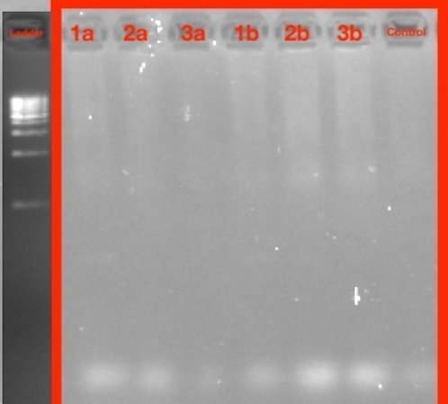

```{r setup, include = FALSE}
# When knitting, hide R code chunks from being shown within the knit document
knitr::opts_chunk$set(echo = FALSE, message = FALSE, warning = FALSE)
``` 

# Introduction

Cell phones have become an essential tool for modern-day life; in fact, most people tend to not leave the house unless they have their cell phone present. With cell phones becoming more a necessity rather than an accessory, it is interesting to see how much bacteria our cell phones can collect from our daily lives. In fact, in a 2014 study done by Meadow et. al, they found that about 22% of the bacterial taxa on participants’ fingers were also present on their own phones, as compared to 17% they shared on average with other people’s phones [@meadow2014mobile]. Meadow et. al's study implies that not only do cell phones hold potential as carriers to our microbiome bacteria, but also to all types of bacteria that are encountered throughout daily life.

This idea is more worrisome when considering how much bacteria our cell phones can bring in, especially when working in expectedly sterile environments such as hospitals or emergency rooms. Karabay et. al (2007) found that health professionals in a teaching hospital in Turkey carried around cell phones that did get contaminated with bacteria, such as *E. coli*, which then could have caused hospital infections [@karabay2007role]. In this study, 111 of the 122 samples tested exhibited bacterial growth with ten (9.0%) samples indicating infectious bacteria such as *E. coli*, two *Enterococcus feacalis*, two *Pseudomonas aeruginosa*, one *Pseudomonas fluorescensis*, and one *Klebsiella pneumoniae* [-@karabay2007role]. 

In 2009, Ulger et. al, found that from the cell phone screens of 200 health care workers tested at Turkey's Ondokuz Mayis University Faculty of Medicine, 94.5% showed evidence of bacterial contamination [@ulger2009we]. These results indicated that both the workers' hands and phones were similarly contaminated with various types of microorganisms  [-@ulger2009we]. This further justifies that cell phones used in daily practice for health care works may be a source of nonsocial infections in hospitals. However, the risk of unsafe hospital practices are not isolated in only hospitals in Turkey but are seen across the globe. Currently, hospital-acquired infections (HAI) have become a huge concern in all the hospitals around the world due to the increased morbidity and mortality. About 5% and 10% of patients admitted to hospitals end up catching an HAI [@sadat2010bacterial]. In the United States, the reported cost of HAI in 2002 was around 100,000 deaths and costs $20 billion yearly [@sadat2010bacterial]. 

Similarly, in a 2014 article done for Healthcare workers in Nigeria showed the same high percentage of bacterial contamination (94.6%) [@nwankwo2014nosocomial]. Interestingly, they also found that the bacteria isolated from mobile phones of health care workers were more resistant to antibiotics than non-health care worker phones [-@nwankwo2014nosocomial]. To confirm Nwanko et. al's 2014 study, Taher et. al (2019) found that of their isolated bacteria species from the 93 of the studied cell phones, 80% of the bacteria were resistant to antibiotics taken from Nurse and Doctor phones [@taher2019pathogenic]. Thus, this study further emphasizes the dangerous potential for cell phones to be pathogenic bacteria carriers. 

To get a better idea as to the real danger of infections caused by bacteria in phones, a study by Tajeddin et. al determined the rate of contamination of health-care workers’ hands and environmental surfaces in intensive care unit by the main bacteria associated with hospital-acquired infections in Tehran, Iran [@tajeddin2016role]. They found that of everything tested, nurses' aides and housekeepers were the most contaminated staff [-@tajeddin2016role]. These results showed how easily contaminated trusted-sterile environments such as the ICU due to the role and neglect of health care workers when dealing with important bacterial pathogens [-@tajeddin2016role]. 

My project attempts to look more into whether there is a need for more regulation on the hygiene of our cell phones (especially if we work in a hospital setting) [@sepehri2009bacterial]. From a study done by Shakir et. al (2010), they found that from fifty-three cell phones belonging to orthopedic surgeons, 83% had pathogenic bacteria at initial testing and 8% had pathogenic bacteria after disinfection [@sadat2010bacterial]. Furthermore, of the cell phones who did have a high rate of pathogenic bacteria and organic material contamination had a decrease in pathogens/contamination after a single disinfecting process [-@sadat2010bacterial]. Similarly, in 2014, Gashaw et. al found that even a simple decontamination with 70% alcohol was effective in minimizing bacterial contamination on the mobile phones of health care workers [@gashaw2014prevalence]. Both studies insist that appropriate infection prevention measures on mobile phones should be taken to minimize any potential risks due to such high rates of contamination [@gashaw2014prevalence]. These studies are key in stressing the benefits of implementing cell-phone sanitizing protocols within hospitals. This also brings into question as to whether hospitals actually implement these vital protocols, despite its importance.  

My main question is whether students working in hospitals have fewer bacterial species growing on their phones than students who work outside of the medical field and do not have to follow hospital protocols for sterility. Therefore, my hypothesis is that students who do work at hospitals with their phones on hand tend to sanitize/ sterilize their phones more, thus having significantly fewer bacteria than regular college kids who have no necessary cleaning routine for their cell phones.

In this project, I wanted to test different cell phone screens of regular college students who do not work in the health professions versus college students who are cleared to work in a hospital setting. I was particularly interested in college students due to their high-use of phones and from a study finding that there is a higher level of bacterial contamination found in secondary students' mobile [@koljalg2017high]. Furthermore, I chose to test on a University campus, for similar reasons to Ross et. al in 2015, due to the high human population density and variable building usage including lecture halls, gyms, restaurants, residences, and a daycare [@ross2015microbial]. Thus, I sampled random students at the University of San Francisco in San Francisco, California but limited my study to focus on students who carry their phones everywhere (even while working in clinical sites such as Saint Mary's Hospital in San Francisco, California). After collecting my samples, I prepared my collected swabs to be either cultured or culture free and analyzed them for bacterial growth based on number of colonies and different morphotypes.This left me with 12 samples (n = 2 swabs for each student, 12 total) to extract and sequence for bacterial DNA. Further analysis involved PCR protocol, DNA sequencing and editing into phylogenetic trees, and BLASTing to identify the bacteria found in these cell phones.

My results confirmed that bacterial growth is evident in all cell phones, however, the amount of bacteria morphotypes and colonies found in the cell phones of regular students was statistically more than the amount found in the cell phones of nursing students. This result can be attributed to the phone-sanitizing protocols within hospitals which had been notably implemented at Saint Mary's Hospital where the sampled nursing students have their clinicals. However, I also identified the bacteria found in the phones of the regular students (2B and 3B) as *Staphylococcus warneri* strain and *Acinetobacter sp. strain* respectively and one nursing student's phone had matched as the *Moraxella osloensis* strain. Interestingly, all three of the sequenced bacteria were as equally harmful as the other, regardless of whether the student was in nursing or not. The difference in my two results indicates that while cell phones of nursing students are more sanitary in number of bacterial growth, their cell phones still had the potential to carry dangerous and infectious diseases. This emphasizes the need for even more phone regulation when entering a hospital site to avoid any possible contamination when in the presence of sick patients.  

# Methods

I wanted to compare the bacterial growth and diversity within my sample group's cell phone screens. My study first involved sample collection to create both a culture and culture free condition for each sample (n = 6, 12 total). To note bacterial growth and diversity, I prepared my samples following their conditions to grow on dish culture plates and set up either Touchdown PCR Protocol for Sanger Sequencing or PCR for Illumina Sequencing. To confirm successful preparation of each sample, I also used gel electrophoresis and Quibit Fluorometers. Following sequencing, I edited and trimmed my successful sequences using Geneious Prime V.4 2019.2 or bash scripts For further analysis, I used phylogenetic trees and BLAST to sort out my data and support my results. 

## Sampling Plan 

In order to confirm the necessary cell phone sanitizing routine when working in hospitals/ medical professional settings, I sampled this group of Nursing students directly after they come back from working at their clinical site at Saint Mary's Hospital in San Francisco, California at 1:30 pm, Tuesday, September 3rd. I tried to avoid students cleaning their phones solely because of their knowledge of being tested and gained each student's consent to swab their phones during the time and site of collection. After swabbing the health professionals, I planned on swabbing the phones of regular students who use their phones freely around the same time (2:10 pm) to avoid bacterial differences due to different samples using their phones for longer further in the day. Thus, I sampled the second group of students on Tuesday, September 3rd as well on the University of San Francisco Campus. 

## Sample Collection 

For the collection of my samples, I had previously prepared a kit to meet the students at their easiest convenience. This kit contained 2 pairs of gloves (one for each sample group/ collection time), 6 sterile swabbing kit consisting of two swabs per pack, 6 sterile tubes with Phosphate buffer saline (pH 7.4) to preserve the swabs. Each phone from every student required two swabs (n = 6, 12 samples total) which were broken off and placed into the labeled test tube. 

The collection sample groups were separated and assigned into two groups: group A and group B. Group A referred to the group that was current USF nursing students working at St. Mary's Hospital and Group B were non-health related students who did not have a hospital background. Each student was given an ID label for either group A and B and a sample number was given randomly passed on collection order (1A, 2A, 3A, 1B, 2B, 3B). After two swab samples had been taken from each student, one sample went to freeze for later DNA extraction while the other sample was set up for dilution and culture plating. 

### Sample Preparation for Culturing 

I froze one of my sample for DNA extraction and mixed the other sample with 200 ul of PBS (7.4 pH). From this sample, two more tubes were prepped and labeled for a 10x dilution and 100x dilution (n = 3 per student, 18 total). I labeled 18 100mm Petri dish culture plates (with TSA, tryptic soy agar, as growth media) to set up bacterial culturing (n = 3 per group, 6 total). 100 ul was then taken from each sample and spread evenly with 8-10 Rattler beads (Spreader beads). These culture plates were then left to incubate for 37 degrees C overnight. 

#### Culture Measurement

The following day, I measured each culture plate [for growth of colonies and monophytes.](http://https://docs.google.com/spreadsheets/d/1GTZFUkE8nhY6hZebgxoPr_dam9kGWzlqFg1O4--MyUE/edit#gid=0). Each sample was incubated at 37 degrees Celsius and recounted 5 days after. 

## DNA Extraction Protocol 

### Culture DNA Extraction

I selected my culture plates with the most colonies for extraction. With a 1.5 ml tube and a sterile pipette tip, I  collected cells from one colony from each plate (n = 6). For DNA Extraction, each of my amplifications were prepped following the Sigma Plant RED Extract-N-AMP PCR Kit [@amplicon201316s]. Once each sample was done, they were then set up for Qubit protocol. I used Qubit Fluorometric Quantification to quantify the amount of DNA was present in each prepped tube (ng/ul).

### Culture Free DNA Extraction

The original frozen sample that was set aside during sample collection was redistributed and prepped for DNA Extraction (n = 6). I also followed the Sigma Plant RED Extract-N-AMP PCR Kit for preparation of my amplifications [@amplicon201316s]. Once finished, these samples followed the Qubit extraction (6 total). I used Qubit Fluorometric Quantification to quantify concentration of extraction. I recorded all data [with dilution id, concentration, and whether it was the culture or culture-free extraction.](https://docs.google.com/spreadsheets/d/19dQy8kxYwU4dCJ-AuaFwOA8AL4E97rX6VH8wT3gvDuc/edit#gid=0).

## PCR Protocol

### PCR for Culture (+ Sanger)

I set up a Touchdown PCR for the cultured samples (n = 6). Including my negative control, I had a total of 7 samples for PCR. The volumes for my PCR mix were, per sample (n = 7) 10 ul of AMP, 0.8 ul of 27 F primer, 0.8 of 1492 R primer, 1 ul of BSA, 6.4 ul of H2O and 1 ul of Template DNA or 1 ul of water for the control. 17 ul of my master mix was added to each PCR tube (7 total), although the original protocol called for 19 ul, I ended up not having enough mix. The PCR Cycle followed 95 degrees C for 5 minutes, 94 degrees C for 30 seconds, 65 degrees C for 30 seconds, and 72 degrees C for 1 minute. This went on for 10 cycles and each step going down 1 degree per cycle to ensure copies. PCR followed 25 more cycles of 94 degrees C for 30 seconds, 55 degrees C for 30 seconds, 72 degrees C for 1 minute. Finally, 72 degrees C for 10 minutes, and 4 degrees C of holding. 

#### Gel Electrophoresis 

Following PCR, I performed gel electrophoresis on 2 percent agarose gel with SYBR Safe Dye added to it. 4 ul of each sample was pipetted onto the gel and ran under 140V for 30 minutes. 

#### Exo-SAP 

After successful amplification for gel electrophoresis, PCR products were cleaned with ExoSAP (Invitrogen) and sent for unidirectional Sanger sequencing at MCLAB (South San Francisco, CA). This was meant to digest the samples for a better Sanger Sequencing template. 

### PCR of Culture Free Data (+ Illumina)

Following gel electrophoresis, PCR products were purified using AmpureXP magnetic beads (Beckman-Coulter) and quantified using a PicoGreen fluorescent assay (Invitrogen) on a Tecan Infinite M Plex plate reader. My master mix contained 10 ul of AMP, 0.8 ul of 10 uM Iseq 165 F, 0.8 ul of 10 uM Iseq 165 R, 10 ul of BSA, 1 ul of the template of water for the control, and 49.5 ul of H2O (per sample + control, 7 samples total). Purified PCR products were used as the template for a another round of PCR to attach different pairs of forward and reverse Illumina barcodes (Nextera XT Index 2 kit). Other components of the PCR mixtures followed the first PCR. The PCR cycled at 95 degrees C for 3 minutes. Culture Free samples underwent another round of PCR (n = 8) following the cycle of: 95 degrees C for 30 s, 55 degrees C for 30s, and 72 degrees C for 30s, followed by a 5 minute elongation cycle at 72 degrees C. 

#### Qubit 

PCR products were purified and normalized with a SequelPrep normalization plate (Invitrogen), pooled, and quantified again using a Qubit 4 fluorometer (Invitrogen). To verify library size and concentration, TapeStation 4200 (Agilent) was used. 

#### Illumina Library 

This library was diluted to the loading concentration (50 pM) and combined with an Illumina PhiX spike-in library (5% spike in). It was then sequenced on an Illumina iSeq using a 2 x 150 bp consumable cartridge.

## Sequencing and Editing for Culture Data 

After being sent out from the lab, my sequences were uploaded onto Geneious Prime V.4 2019.2.3 for editing and IUPAC Coding (7 total, including water). Only my samples that ran (3a, 2b, and 3b) were edited to make sure there was not too much noise. Any sequence that showed only five base pairs were regarded as a "fail". For my sequences that ran, I corrected any ambiguous DNA base pairs and using [the IUPAC ambiguity code](https://droog.gs.washington.edu/parc/images/iupac.html). Once my samples had a high HQ%, I used MAFFT alignment to realign the working sequences to DNA from my outgroup *Thermus aquaticus* strain YT-1 16 S (downloaded from the NCBI GenBank) [@katoh2013mafft]. The realignment was trimmed at the beginning and end for each sequence to align perfectly with the outgroup. I used PhyML and Mr. Bayes to create two phylogenetic trees for my DNA sequences to the outgroup. The PhyML Tree followed a substitution model of GTR with a Branch Support of Boostrap (100 Bootstraps) [@guindon2010new]. Any other selection were set to the default mode and the tree was created. I selected *Thermus aquaticus* as the root for my tree to act as the outgroup for my samples' branches. Posterior probability was measured as a support value for quantifying relatedness between the branches. To run Mr. Bayes, my realigned sequence that I ran for PhyML was selected again. Mr. Bayes parameters had a substitution model of GTR, a rate variation of invgamma, a chain length of 1,100,000, a subsampling frequency of 200, and a burn-in length of 100,000 [@suchard2006bali]. Any other category was set to default. Mr. Bayes resulted in three files which showed Mr. Bayes posterior output for estimates, tree view, and trace. BLAST was done using NCBI BLAST. Each freshly cleaned sequence was copied into NCBI BLAST query sequence from Geneious Prime V.4 2019.2.3. For each, 16S Ribosomal RNA sequences were selected from the database and ran for results.

## Sequencing and Editing for Culture Free Data

All Illumina sequences were edited using bash scripts. First, all sequences were unzipped into fastq files. These files were analyzed by their FastQC reports for quality of sequencing. I then trimmed each sequencing using Trimmomatic [@bolger2014trimmomatic]. Trimmomatic chopped off the first and last 5 nucleotides of each sequence and looked at everyone 8 nucleotides to see if they matched a quality level above 25. Any sequence that did not have a minimum length of 140 was disregarded. After proper editing, my fastq files were converted into fasta files for better encoding of the BLAST results. BLAST was run on the terminal for all Illumina sequences and summarized via the cut function [madden2013blast].

# Results

I wanted to confirm that there was a statistically significant difference between the bacterial growth and diversity of Nursing Students and Regular Students and note any phylogenetic difference between the bacteria on each groups' cell phones. My samples confirmed proper PCR set-up as all my sequences had an appropriate Qubit level and most of my sequences had successfully run gel electrophoresis except for one (Figure 1, 1B). I gathered by my culture data and culture free data of each sample to test colony abundances, morphotypes, and sequencing. I confirmed that there was a higher colony abundance and colony morphoptypes on the cell phones of Regular Students compared to Nursing Students using a Wilcox test. Further sequence analysis involved BLAST results and phylogenetic trees (PhyML and Mr. Bayes) to compare phylogeny of my sequenced bacteria. I found that while each sample had tested for bacterial growth, Regular students had greater phylum abundance and diversity in comparison to Nursing Students. However, I also found that the bacteria in Nursing Students still had bacteria that was just as infectious as the bacteria found in Regular Students.

## Qubit Data and Gel Electrophoresis

I had collected Qubit data from all my samples to ensure DNA content (Table 1). This provided a more accurate measurement of how much DNA was successfully extracted in my samples. All my samples were confirmed  with a high Qubit value (~3-30 ng/ml), thus indicating a good amount of DNA was present in my samples to be confident in preparation for PCR (Table 1). Following Touchdown PCR of my Culture samples, gel electrophoresis was done to analyze DNA molecular size and compare it alongside other samples. Each gel ran on 2 percent Agarose gel with SYBR Safe Dye added to it and ran overnight alongside a ladder (Ez load 1 kb Molecular Ruler) for comparison (Figure 1). My final gel electrophoresis for my Culture Data showcased strong bands are seen in samples 1A, 2B, and 3B. 2A and 3A were described as light bands but are still prominently shown. However, 1b and the control failed to run at all, producing no bands (Figure 1). I also ran gel electrophoresis to confirm my Culture Free samples and found that this gel was different in comparison to the Culture Data (Figure 1) as these bands appeared much lower within the gel (Figure 2). Bands for 1a, 2a, 1b, and the control all appeared very faintly in comparison to 2b and 3b which were much more distinct white bands. The sample, 3a, appeared most lightly on the gel in comparison to the other run bands. These gel images show how the DNA within the samples were separated based on size and charge. This was also done to help indicate whether our PCR protocol would work by confirming that the samples had contained DNA which resulted in this formed bands (Figure 2). 

## Culture Data 

After ensuring that my samples had run to completion, I also wanted to quantify my culture data for any statistically significant results between my two sample groups by using my previously collected data for counting colony abundances and morphotypes. This data was taken after analyzing my Petri TSA plate samples, using the sample dilutions with the most amount of data. From this collected data, I used a box plot to see the average and any outliers within my data (Figure 3, 4). I also used a statistical test in order to determine how statistically significant my results were to make a confident conclusion as to how to interpret my data. My box plots from my culture data show that the number of colonies between the two groups (Group A - Nursing, Group B - Regular) were statistically different (p = 0.0365, Figure 3). Also seen in the number of morphotypes, their was also a statistically significant that suggests evidence of rejecting the null hypothesis due to p = 0.05 (Figure 4). This data confirms that there the higher number of colonies and different morphotypes within Group B (regular college students) in comparison to Group A (nursing students) is statistically significant.

## Sequencing 

### Sanger Sequencing 

As my samples were sent to a lab and returned from Sanger Sequencing, each DNA file was analyzed as whether they had failed or ran completely. Files that ran completely were cleaned and trimmed to be adjusted into a higher quality sequences (Table 2). My successful sequences were 3A, 2B, and 3B. The other sequences had failed to run code (showing 'NNNN only) or had too much noise (2A). My trimmed sequences were also trimmed further in order to align with the sequence of my outgroup *Thermus aquaticus* strain YT-1 16 S. Any ambiguity was manually corrected following [the IUPAC ambiguity code](https://droog.gs.washington.edu/parc/images/iupac.html). The edited sequences were analyzed using BLAST through NCBI GenBank (Table 3). Each successful sequence had a high percent identity with its match found. 3A was matched with the *Moraxella osloensis* strain, 2B with the *Staphylococcus warneri* strain, and finally 3B had the *Acinetobacter* strain. Other strains had failed to sequence therefore not coming with any matches. Following successful sequencing, my sequences were then aligned for proper phylogenetic analysis using Geneious Prime. My phylogenetic trees represent the relatedness between my sequences and the outgroup, *Thermus aquaticus*. Phylogenies allow for easier identification of the bacteria found on my samples. Two phylogenetic trees were created using different methods of construction, PhyML and Mr. Bayes. The PhyML Tree used the parameters of substitution model of GTR with a value of 100 Bootstraps (Figure 5). Mr. Bayes ran also under GTR, a rate variation of invgamma, a chain length of 1,100,000, a subsampling freq of 200, and a burn-in length of 100,000 (Figure 6). Phylogenetic differences between the two trees are based on the placement of 2b in relation to the related 3A and 3B and the outgroup. I found that both trees strongly associate 3A and 3B together with PhyML tree's bootstrap value of 100 and Mr. Bayes is about 0.999 (Figure 5, 5, ML bootstrap 100 ~= Bayes 0.999). While PhyML associates 2B more closely related to 3A and 3B, Mr. Bayes places 2B alongside the outgroup.  

## Illumina Sequences 

After unzipping my Illumina Sequences, I looked at my fastq files' FastQC Reports to see level of quality of the Illumina Sequences ran. Each of my sequences were not flagged for poor quality and was regarded as a successful run (Table 4). AJ-1a_S61_L001_R1_001 and AJ-1b_S64_L001_R1_001 both had the same Sequence Length of 147-151 while AJ-2a_S62_L001_R1_001 and AJ-3b_S66_L001_R1_001 also had the same length of 41-151 (Table 4). AJ-2b_S65_L001_R1_001 and AJ-3a_S63_L001_R1_001 had sequence lengths that were one off from the first two groups respectively (Table 4). I looked at %GC which indicates all counted G and C base pairs over total count of all possible base pairs (Count(G + C)/Count(A + T + G + C) * 100%.). Sequences AJ-1a_S61_L001_R1_001, AJ-1b_S64_L001_R1_001, and AJ-2b_S65_L001_R1_001 had a %GC of 52% while the rest of the sequences had 53%. All %GC were within the range to have all the sequences be regarded as quality sequences (Table 4). For further quality of my sequences, I used Trimmomatic to edit my sample sequences. 'Before Trimming' data was taken from the FastQC reports under 'Total Sequences' for each sample (Table 5). Total sequences is a count of the total number of sequences processed. 'After Trimming' data was taken from the command line using the grep-c function within my illumina sequence data. Percentage survived average these two data sets. Samples AJ-1b_S64_L001_R1_001, AJ-2b_S65_L001_R1_001, AJ-3a_S63_L001_R1_001 were able to keep around 95% of the original sequences. While samples AJ-1a_S61_L001_R1_001, AJ-2a_S62_L001_R1_001, and AJ-3b_S66_L001_R1_001 kept around 93% of their original sequence. All samples maintained a high percentage survival which indicated that all sequences successfully ran (Table 5).

All Illumina Sequences for the samples successfully ran and were able to be processed for BLAST sequencing. The result of this BLAST showed 10 different bacteria types for each of my Illumina sequences. As each of the samples equally had same amount of sequences for each taxa of bacteria for each set of 10, trends were analyzed between each sample (Table 6). However, a lot of my samples had tested for uncultured *bacterium* as their first or second highest bacterium number. Samples 2a and 2b had uncultured *bacterium* as their highest identified taxa while Samples 1a, 1b, 3a, 3b all had a specific highest identified bacteria. Sample 1a tested for *Acinetobacter ursingii* and it was interesting that each sequence except for AJ-2b_S65_L001_R1_001 tested for a type of *Acinetobacter*. Sample 1b tested for *Haemophilus parainfluenza*, 3a had a *Petrocodon jingxiensis*, and 3b tested for *Corynebacterium acolens*. All of the samples had a BLAST result of a certain type of *Bacillus* or *Bacillaceae* were present in their sequences.


## Abundance and Diversity
I wanted to confirm the different phyla within my sample groups. I found that (Figure 7). I also wanted to compare the sum abundance of the phyla between the sample groups and found that *Actinobacteria* and *Proteobacteria* were the most common among all sample groups (~25,000). Next was the amount of *Firmicutes* which was around ~18000 and actinobacteria which was around ~20,000 (Figure 7). In order to compare the sum abundance between just my two sample groups, I found that Nursing students contained a higher sum abundance value across all phyla in comparison to the Regular Students (Figure 8). I also used the mean abundance for reference, in comparison to sum abundance, to show any variance and outliers (Figure 9). From the mean abundance, I reconfirmed that Regular students had a greater mean abundance across all found ohyla  (Figre 10). To confirm this diversity measure, I also looked at Alpha Diversity Measure of my samples in comparison to Simpson and Shannon's indexes (Figure 11). From this data set, I found that Nursing students had less of diversity measure in comparison to its Simpson control due to the added outlying data (Figure 11) (Nursing was around ~0.9). I also wanted to look at my similarity index and found that it is mostly the all negative control (~0.4) (Figure 11). From Shannon's similarity index, the Group type for the BLAST command with Regular students having the most amound of diversity index and Simpson having the highest  

## Any Error
A bar graph was created to identify which strands from my samples did not run successfully (Figure 12). Runs that were not satisfactory, like %GC, were disregarded. I found that # my sample 3b tamed me from popping off "Non-Available"   I

# Discussion 

## Summary 

Mobile phones have become one of the indispensable accessories in everyday modern life [@karabay2007role]. Cell phones are taken with us everywhere even in hospital halls, laboratories, and/or intensive care units when dealing with severe illnesses [@karabay2007role]. Moreover, college students were also noted to not only take their phones everywhere, but also are exposed to the most among germs do the density of college campuses and students [@ross2015microbial]. Thus, my study attempted to analyze whether college students who do enter hospitals (such as Nursing students) have the potential at being bacterial carriers for infections due to their cell phone use. Specifically, I had sampled the phones of 6 total college students at the University of San Francisco, 3 of which were Nursing students working at the clinical site at Saint Mary's Hospital while the other 3 were just regular non-health related students. I had wanted to see whether Nursing students did sanitize their phones and take extra precautions in limiting their bacterial contact in comparison to regular college students. I hypothesized that Nursing students were required to clean their phones, thus showing less bacterial growth. 

My Culture data confirmed my hypothesis statistically as there was a reported difference in the number of colonies found between the two groups (Figure 3). I also looked at the number of morphotypes with the colonies as colony morphotypes as a common measurement for diversity and/or isolation of the dominant species within bacterial communities [@10.1111/j.1574-6968.1998.tb12903.x] (Figure 4). For both conditions, I found that Nursing Students had less morphotypes and colony abundance in comparison to Regular Students. However, interestingly, I found that the bacteria found in the phones of the regular students (2B and 3B) indicated bacteria that were just as likely to be infectious than the bacteria found from the nursing student (3A). 2B showed up as the *Staphylococcus warneri* strain and 3B was the *Acinetobacter sp. strain*, while 3A had matched as the *Moraxella osloensis* strain. This contradicted previous studies which indicated that those who worked in the medical/ healthcare setting had much more resistant and dangerous bacteria found within their phones [@taher2019pathogenic]. While there was no complete indication that Nursing students had fewer bacteria than regular students, it was evident that Nursing students (Group A) had much fewer morphotypes in the colonies found in Group B. This data provided some evidence that Nursing students, at least the University of San Francisco, have much better safety precaution against high levels of bacterial growth in comparison to regular college students.  

My Culture Free data also confirmed the idea that each of the species identified on cell phones were just as likely to be as infectious as the other regardless of whether the cell phone belonged to a Nursing Student or Regular Student. All sequences (except for the sequence of sample 2B: AJ-2b_S65_L001_R1_001) had tested for a type of *Acinetobacter* and  all of the samples had a type of *Bacillus* or *Bacillaceae*. These species are common for types of bacterium and can be a harmful pathogen for infectious diseases depending on the specific taxa. One interesting result from almost all samples testing for *Acinetobacter*, is that *Acinetobacter* are gram-negative organisms that can cause infections in any organ system often found within hospitalized patients and the fact that it was also present in all of the Regular Students indicated that the level of how harmful/ infectious the pathogen present on a cell phone did not differ on whether the cell phone user was exposed to the hospital setting as a Nursing student or a Regular student [-@kuo]. The species of *Bacillus* also has a clinical spectrum of infections which include things like food poisoning, localized infections related to trauma, deep seated soft tissue infections, and systemic infections [@weber1988vitro]. As Sample 1a tested for *Acinetobacter ursingii*, Sample 1b had *Haemophilus parainfluenza*, 3a had a *Petrocodon jingxiensis*, and 3b tested for *Corynebacterium acolens*, each of these bacterium are known to create an airborn infection usually found within hospitals. Thus, a majority of my Culture Free data contradicted my original idea that Regular Students would have more harmful bacteria due to their lack of sanitation, but instead shows that regardless of group type (A: Nursing students, B: Regular students) all samples tested for similar bacterial types.  

The end result of my report showed that while Regular Students had statistically shown a significant amount of bacterial colonies and morphotypes compared to Nursing Students, the level of how harmful/ infectious the bacteria (or bacteria type) did not differ between the two groups. While Nursing Students had less bacteria due to their sanitizing protocols, there is still the potential for the student to bring in an HAI into a hospital setting. Thus, further study on different sanitizing methods to properly kill off a majority of these infectious strains is required to come up with a better way of protecting hospital patients and workers. 

## Interpretation of Sanger Sequencing and Taxa

From my evidence found in Figure 4, it can be interpreted that there are many more types of bacteria and amount of colonies growing on regular students’ cell phones in comparison to the Nursing students. This could be due to the fact that Nursing students are found in the sterile environment, and as pointed from the data that they do clean their phones, they are more likely to come across the same type of bacteria rather than regular college students who can go around anywhere without worrying about sanitizing. There is also the interpretation that the number of colonies may not be as indicative when comparing the "cleaner" phone (fewer bacteria), as colony growth can vary between types of bacteria whether it be based on environment, growth rate, conditions, temperature. Thus, I found the number of morphotypes to be more indicative of the difference between nursing students and regular students.

However, the difference between the two groups could easily be manipulated based on uncontrollable variances in each student’s life. For example, one student could use their phones much more carelessly by placing it on dirty surfaces, letting it stay on the floor, while another student could keep their phones in their backpacks for the day. There could also be differences in lifestyles as nursing students, like someone being on their phone during clinical site, while the other keeps it in their pocket most of the time. There was also a difference in livelihood like someone living in the dorms or a crowded house, visiting the gym more often, or even general body hygiene (such as washing hands). While I do think my data is statistically significant, it is also important to consider all possibilities when considering the two groups. 

It was also interesting to see the data from Table 3 that indicates the BLAST matches of each successfully ran sequence (3A, 2B, 3B). From these sequences and the bacteria associated, it is also easier to interpret the phylogenetic trees (Figures 4, 5). I agreed that both trees had correctly placed 3A and 3B together due to the high bootstrap values of PhyML tree's being 100 and Mr. Bayes is about 0.999 (Figure 5, 6, PhyML bootstrap = 100, Bayes = 0.999). While PhyML associates 2B more closely related to 3A and 3B, Mr. Bayes places 2B alongside the outgroup. This can be better interpreted through understanding the epidemiology of exactly the bacteria that most matched my data from the NCBI GenBank BLAST tool was. I found that the *Staphylococcus warneri* strain most matched my sample 2B, 3B as the *Acinetobacter sp.* strain, and 3A was most matched to the *Moraxella osloensis* strain. As previously mentioned, each bacteria was found to be just as probable for infection if spread and contaminated.

While I agree with the bootstrap values of my phylogenetic tree, it was hard to actually pinpoint what made 3A and 3B much more closely related in comparison to 2B. I did mention that each of the bacteria strands was just as probable for infection, there were differences in the severity of each infection. For sample 2B, *Staphylococcus warneri*, is a member of the bacterial genus *Staphylococcus* which can cause infection in patients whose immune system is compromised [@campoccia2010characterization]. *S. warneri* causes infectious usually in association due to implant materials, orthopedic infections, or the absence of a foreign body [-@campoccia2010characterization] orthopedic infections. Also dealing with skin and epithelium, the *Moraxella osloensis*, found as 3A, is also a gram-negative bacterium that is saprophytic on skin and mucosa [@lim2018complete]. This strain, like the *Staphylococcus*, is frequently involved in human infectious diseases [-@lim2018complete]. Found in 3B, *Acinetobacter* is also the genus of Gram-negative bacteria belonging to the wider class of *Gammaproteobacteria* which are known to cause high mortality infections like its strand *A. baumannii* with high virulence and antimicrobial resistance [@kuo]. *Acinetobacter spp.* first began to be recognized as significant healthcare-associated pathogens during the 1970s and many of these infections involve multi drug-resistant strains and occur in intensive care or high-dependency units in which severely-ill or debilitated patients are treated extensively with broad-spectrum antibiotics [-@kuo]. Thus, based on where the bacteria attacks, it would be more considerable that 2B and 3A were more closely related than 3A and 3B based on the level of virulence. However, after more research, *Staphylococcus* was less likely to be as deadly as 3A and 3B when it comes to being infectious. Thus, from my data, it can be interpreted that 3A and 3B are more closely related as seen in Figures 4 and 5, while 2B is more closely related to the outgroup the *Thermus aquaticus.* To determine how much closer related 2B was to the outgroup, a study done by Delarue et. al stuck out in which they looked at the polymerase sequence from bacteriophage and found that to be homologous to the polymerase domain of polymerase I from Escherichia coli, which is also closely related to those from *Staphylococcus pneumoniae*, *Thermus aquaticus* [@delarue1990attempt]. Thus, the shared homology with this bacteriophage that Delarue et. al looked at also indicates a link between Staphyloccocus and *Thermus aquaticus*. From this study, the correct taxa from my data are seen within my Mr. Bayes phylogenetic tree (Figure 6). 

## Interpretation of Illumina Sequencing and Taxa

Each of my Culture Free samples were able to properly sequence and run through BLAST with high quality reads (Table 4, 5). Each of the samples also listed for 10 different bacterium with equivalent presence in each sample (Table 6). 

In contrast with my Culture data, 2B did not show up as the *Staphyloccus warneri* strand, but instead had a BLASTed for either an uncultured *bacterium* or *Streptococcus penumoniae* (Table 6). 3B did not test for an *Acinetobacter sp. strain*, but instead a *Corynebacterium accolens*. 3A did not sequence for any *Moraxella osloensis* strain, but instead tested for *Petrocodon jingxiensis*. However, these bacterial species are still just as infectious as the species identified in Sanger Sequencing. This contradicts previous studies that Nursing Students had less infectious pathogens within their cell phones, as the common genera amongst all samples were all potentially infectious. 

I am much more confident in these newly resulting identified bacterium due to the fact that the Culture Free data relied on Illumina Sequencing rather than Sanger Sequencing. This is important because Sanger sequencing only allows for a single DNA fragment at a time, while Illumina Sequencing, a type of Next Generation Sequencing, can sequence millions of fragments simultaneously per run. Illumina Sequencing is considered a high-throughput process which results in a more with deep sequencing, which gives me much more confidence in the bacteria identified from my Culture Free data rather than my Cultured.

What was most interesting was that all sequences for the Regular Students (1B, 2B, 3B) did test for a type of *Actinomyces* or *actinomycete*. This was important as actinomycosis is a rare chronic disease caused by the *Actinomyces*, an anaerobic Gram-positive bacteria that normally colonize the human mouth and digestive and genital tracts [@kim2014actinomyces]. While 3A also tested for *Actinomyces sp.*, the majority trend of Regular Students all containing the pathogen provided potential evidence that could have supported my hypothesis that Regular Students would have a greater number of harmful pathogens. However, from the other similar types of genera present in all samples, I came to the conclusion that all types of bacterium can occur on any type of phone, regardless of profession or the frequency of cell phone sanitation. 

##  Diversity and Abundance

To confirm my previous studies on diversity and abundance, I created a phyloseq object in order to compare and create figures using my melted phyloseq sample data. I wanted to analyze the different phylum wtihin all of my sample groups. I found that a majority of all my samples had tested for the phyla: *Actinobacteria, Firmicutes,* and *Proteobacteria* (Figure 7). This data set was important to be able visualize the data that will be filtered out further, with Regular Students showcasing the most amount of abundance. It also gave us a better idea as to what types of bacteria were present. These three phyla that were present within the entire data set are all equally infectious (Figure 7). This data set also confirmed my BLAST results from Illumina that *Actinobacteria* is heavily present in all samples. This shows that neither Nursing Students and Regular Students have a more/ more likely to get infectious disease. Instead, it was important to focus on the fact that Regular Students were more likely to get bacteria based on the fact that they sanitize less. 

I created both a sum and mean abundance plot to compare the two sample groups together (Nursing vs Regular Students) with any variance or outliers. I found out that this abundance had indicated that Regular Students had a larger mean/ range of its data set, while the sum indicated that there was more abundance within Nursing Students (Figure 9, 10). However, as previously stated, my negative controls were always unreliable due to the use of *E. coli* as a model. Thus, I wanted to look solely at my specific, collected samples. I used both a sum and a mean abundance as a mean gives a better indicator for the data as it also includes any variance. Most of my data within Figure 11 showcase that Regular Students tend to have a more diverse, both statistically/ numerically, amount of bacteria growining within their cell phone screens. Using a Shannon test, I found the diversity index of Regular Student's to be the highest as the outlier has an Alpha Diversity Measure of around 4.0 (Figure 11). In contrast, I used a Simpson test to look at diveristy and also found that Regular students had a higher outlier Alpha Diversity Measure of ~0.98 (Figure 11). This data confirms the idea that Regular Students contain a higher, more diverse amount of different bacteria within their cell phone screens. 

## Error Analysis 

Due to the low number of actual sequencing DNA, it can be interpreted that there may have been something wrong during collection, extraction, PCR protocol, or even sequencing and everything in between (Table 2). 

Key data points that may have resulted in a lack of successful sequencing could be due to experimental error. During PCR Protocol, my master mix had actually run out before the 19 ul could be delivered to each sample. Instead, I had decided to modify the procedure and use 17 ul. Thus, there could be an indication that there was not enough template for the sequence to amplify. My data also showed a lot of compression among sequences indicating DNA fragments of different sizes with the same electrophoretic mobility (@dillon). This phenomenon is thought to be caused by regions of secondary structure within the template DNA which could be due to PCR not having high enough temperature for denaturing. Also notable, my gel electrophoresis already indicated a failure in 1B (Figure 1), which coincides with the idea that my sequences failed to run. There were also issues with editing my sequences as a lot of them were judgment calls. This could have caused change base pairs that were manipulated to better fit one bacteria more as opposed to another. This could also have skewed the placement of my phylogenetic tree. 

Other evidence of experimental failure could be due to cross-contamination, whether it be from extracting too much TSA when scraping the culture from the culture plates or by not being extra cautious when using pipette tips and handling other tools. As my Qubit data showed high numbers in the correct range, there is also the possibility that the bacteria that are found on the phones are resistant to PCR, air, water-- indicating that there is a lot of versatility in bacteria that my protocol could not account for. If that is the case, PCR could be redone at high temperatures to ensure complete denaturing of the DNA strands and longer cycles for higher amplification.

Any other error in data from my Culture Free samples would be due to machine error. This can be attributed to any errors within command line (such as improper git pushes and cloning) or simple program errors from R Markdown or any other terminal commands. I had noted in that within different samples, some phyla were never identified (Figure 12). This can confirm the possibility of contamination within my part or a problem with the way my phyloseq object or R markdown decided on assigning different phyla. Other issues can be due to poor server connection when attempting to access the Tule sever within the University of San Francisco Network.


# Tables and Figures 

```{r load-libraries}
# Library of all installed packages to run data
library("ggplot2")
library("dplyr")
library("tidyr")
library("readr")
library("broom")
library("knitr")
library("citr")
library("lintr")
library("dada2")
library("phyloseq")
library("ggrepel")
```

## Table of Quibit Data 

|   Sample Group  | Sample ID  | Dilution | Qubit Concentration (ng/ml) |  Sample Type |
|:---------------:|:----------:|:--------:|:---------------------------:|:------------:|
| Nursing Student |     1a     |    100   |             5.13            |    Culture   |
| Nursing Student |     2a     |    100   |             8.09            |    Culture   |
| Nursing Student |     3a     |    100   |             9.75            |    Culture   |
| Regular Student |     1b     |     1    |             7.08            |    Culture   |
| Regular Student |     2b     |     1    |             7.4             |    Culture   |
| Regular Student |     3b     |     1    |             10.8            |    Culture   |
| Nursing Student |     1a     |     1    |             6.05            | Culture Free |
| Nursing Student |     2a     |     1    |             5.52            | Culture Free |
| Nursing Student |     3a     |     1    |             4.82            | Culture Free |
| Regular Student |     1b     |     1    |             5.91            | Culture Free |
| Regular Student |     2b     |     1    |             5.23            | Culture Free |
| Regular Student |     3b     |     1    |             4.34            | Culture Free |

**Table 1:** Table of all Qubit values for each sample. Sample types are separated between Culture data (for Sanger) and Culture Free data (for Illumina). Qubit concentration shows the nanogram of DNA is present with every ml of Qubit solution.

## Gel Electrophoresis Image 

### Image for Culture Data 


**Figure 1:** Image of Gel Electrophoresis for Culture Data. PCR bands corresponding from samples 1A, 2A, 3A, 1B, 2B, 3B, and control (left to right) are shown within the red box highlighted. A ladder is shown (furthest to the left) for comparison.

### Image for Culture Free Data



**Figure 2:** Image of Gel Electrophoresis for Culture Free Data. Each PCR bands corresponds to the samples 1A, 2A, 3A, 1B, 2B, 3B, and control (left to right) are shown within the red box highlighted. A ladder is also present (furthest to the left) for comparison.

## Culture Data

```{r read-in-culture-data}
# read in the culture data from csv
culture_data <- read.csv(
  "data/raw_data/raw_culture_count_data/BIOL422_culturing_data.csv")
```

### Culture Data Colony 100x Box Plot 

```{r filter-and-plot-abundances}
# filter out only my 100x dilutions and make a boxplot
culture_data %>%
  filter(student_name == "Angela_Jocson") %>%
  filter(dilution_1_10_or_100 == "1") %>%
  ggplot(aes(x = sample_group,
             y = as.numeric(number_of_colonies))) +
  geom_boxplot() +
  ggtitle("Comparison of colony abundances
          between Nursing Students and Regular Students", "1x dilution") +
  xlab("Sample Group") +
  ylab("Number of Colonies")
```

**Figure 3:** Boxplot of colony abundances at different sites, 1x dilution. The higher median number, and total number, of colonies from Regular Students versus Nursing Students was statistically significantly between the two sites (Wilcox p = 0.03650, rejec the null hypothesis). 

```{r abundances-stats}
# run a statistical test to compare the two groups of abundances
## if p value is greater than 0.05 then fail to
## reject null hypothesis that they are equal

culture_data %>%
  filter(student_name == "Angela_Jocson") %>%
  filter(dilution_1_10_or_100 == "1") %>%
  wilcox.test(data = .,
              as.numeric(number_of_colonies) ~ sample_group) %>%
  broom::glance(x = .) %>%
  knitr::kable()
```
## Culture Data Morphotype 100x Box Plot 

```{r filter-and-plot-morphotypes}
# filter out only my 100x dilutions and make a boxplot
culture_data %>%
  filter(student_name == "Angela_Jocson") %>%
  filter(dilution_1_10_or_100 == "1") %>%
  ggplot(aes(x = sample_group,
             y = as.numeric(number_of_morphotypes))) +
  geom_boxplot() +
  ggtitle("Comparison of morphotypes between Nursing Students
          and Regular Students",
                "1x dilution") +
  xlab("Sample Group") +
  ylab("Number of Morphotypes")
```

**Figure 4:** Boxplot showing the number of morphotypes from the two different sites. Nursing students morphotypes averaged >5, while Regular students had an average of ~7 morphotypes. There was a difference in the mean number of morphotypes (Wilcox p = 0.05, reject the null hypothesis).

```{r morphotype-stats}
# run a statistical test to compare the two groups of abundances
culture_data %>%
  filter(student_name == "Angela_Jocson") %>%
  filter(dilution_1_10_or_100 == "1") %>%
  wilcox.test(data = .,
              as.numeric(number_of_morphotypes) ~ sample_group) %>%
  broom::glance(x = .) %>%
  knitr::kable()
```

## Sequencing 

## Table for each of my sequences 

| Sample ID | Original File Name     | Corrected File name                    | Usability | Length after Trimming | Manually Adjusted Bases |
|-----------|------------------------|----------------------------------------|-----------|-----------------------|-------------------------|
| 1A        | 1a_100x_AJ_27f_A10.ab1 | 1a_100x_AJ_27f_A10_AJ_Failed.ab1       | No        | N/A                   | N/A                     |
| 2A        | 2a_100x_AJ_27f_B10.ab1 | 2a_100x_AJ_27f_B10_AJ_Failed_Blast.ab1 | No        | N/A                   | N/A                     |
| 3A        | 3a_100x_AJ_27f_C10.ab1 | 2b_1x_AJ_27f_E10_AJ Cleaned.ab1        | Yes       | 520                   | 2                       |
| 1B        | 1b_1x_AJ_27f_D10.ab1   | 1b_1x_AJ_27f_D10_AJ_Failed.ab1         | No        | N/A                   | N/A                     |
| 2B        | 2b_1x_AJ_27f_E10.ab1   | 2b_1x_AJ_27f_E10_AJ Cleaned.ab1        | Yes       | 518                   | 8                       |
| 3B        | 3b_1x_AJ_27f_F10.ab1   | 3b_1x_AJ_27f_F10_AJ_Cleaned.ab1        | Yes       | 496                   | 2                       |

**Table 2:** Table showing the locus of each sequence (16S), original file name of each sequence, the file name after correcting or marking as failed, its usability (usable vs unusable), length after trimming, and number of manually corrected in the remaining sequence after trimming.

## Table for each of my successful Sanger Sequences after BLAST 

| Sample | Description                             | Percent Identity | Query Cover | Ascension  | E Value |
|--------|-----------------------------------------|------------------|-------------|------------|---------|
| 1A     | Sequence Failed                         |                  |             |            |         |
| 2A     | Sequence Failed                         |                  |             |            |         |
| 3A     | *Moraxella osloensis* strain PK2-16.2   | 98.65%           | 99%         | MN428170.1 | 0.0     |
| 1B     | Sequence Failed                         |                  |             |            |         |
| 2B     | *Staphylococcus warneri* strain SR5-28 | 99.61%           | 100%        | MN421516.1 | 0.0     |
| 3B     | *Acinetobacter sp.* strain GR14 16S     | 100%             | 100%        | MH883927.1 | 1e-139  |

**Table 3:** Table of successful Sanger Sequences after NCBI BLAST Results. This table indicates the BLAST result metrics which include description, percent identity, query cover, ascension and E value. 

## Phylogenies 

### PhyML Phylogenetic Tree


**Figure 5:** PhyML Phylogenetic tree run on Geneious Prime from Sanger Sequencing Data. Sequences that ran are 3A, 2B, and 3B with an outgroup of *Thermus aquaticus* strain YT-1 16 S.

### Mr. Bayes Phylogenetic tree


**Figure 6:** Mr. Bayes Phylogenetic tree run on Geneious Primer from Sanger Sequencing Data. Sequences that ran are 3A, 2B, and 3B with an outgroup of *Thermus aquaticus* Strain YT-1 16 S.

## FastQC Report

|       File Name       | Sequences Flagged as Poor Quality | Sequence Length | %GC |
|:---------------------:|:---------------------------------:|:---------------:|:---:|
| AJ-1a_S61_L001_R1_001 |                 0                 |     147-151     | 52% |
| AJ-1b_S64_L001_R1_001 |                 0                 |     147-151     | 52% |
| AJ-2a_S62_L001_R1_001 |                 0                 |      41-151     | 53% |
| AJ-2b_S65_L001_R1_001 |                 0                 |     146-151     | 52% |
| AJ-3a_S63_L001_R1_001 |                 0                 |      42-151     | 53% |
| AJ-3b_S66_L001_R1_001 |                 0                 |      41-151     | 53% |

**Table 4:** Table of the data taken from FastQC reports. Data showcased any sequences flagged as poor quality (failure to run), sequence length, and %GC (Count(G + C)/Count(A + T + G + C) * 100%.). 1A (Nursing Student) had a sample file name of AJ-1a_S61_L001_R1_001, 1B: AJ-1b_S64_L001_R1_001 (Regular Student), 2A (Nursing Student): AJ-2a_S62_L001_R1_001, 2B: AJ-2b_S65_L001_R1_001 (Regular Student), 3A (Nursing Student): AJ-3a_S63_L001_R1_001, and 3B: AJ-3b_S66_L001_R1_001 (Regular Student). 


## Trimmmomatic Data

|       Sample ID       | Before Trimming | After Trimming | Percentage Survived |
|:---------------------:|:---------------:|:--------------:|:-------------------:|
| AJ-1a_S61_L001_R1_001 |       8428      |      7891      |        93.62%       |
| AJ-1b_S64_L001_R1_001 |      11693      |      11129     |        95.18%       |
| AJ-2a_S62_L001_R1_001 |       7788      |      7310      |        93.86%       |
| AJ-2b_S65_L001_R1_001 |      15715      |      14989     |        95.38%       |
| AJ-3a_S63_L001_R1_001 |      14939      |      14245     |        95.35%       |
| AJ-3b_S66_L001_R1_001 |      13216      |      12393     |        93.77%       |

**Table 5:** Table showcasing sequence number of each sample ran (percentage survived = after trimming /before trimming). 

## Command-line BLAST Analysis

|       File Name       | Highest Identified Blast Result | Second Blast Result        |
|:---------------------:|---------------------------------|----------------------------|
| AJ-1a_S61_L001_R1_001 | *Acinetobacter ursingii*        | *Massilia timonae*         |
| AJ-1b_S64_L001_R1_001 | *Haemophilus parainfluenza*     | *Streptococcus pneumoniae* |
| AJ-2a_S62_L001_R1_001 | uncultured *bacterium*          | *Acinetobacter tandoii*    |
| AJ-2b_S65_L001_R1_001 | uncultured *bacterium*          | *Streptococcus pnuemoniae* |
| AJ-3a_S63_L001_R1_001 | *Petrocodon jingxiensis*        | uncultured *bacterium*     |
| AJ-3b_S66_L001_R1_001 | *Corynebacterium accolens*      | uncultured *bacterium*     |

**Table 6:** Image showcasing final BLAST result from fasta Illumina sequence sample files on the command-line Terminal. All sequences are highlighted in red or indicated via the arrow. Each sequence had BLASTed for 10 different bacteria types with 1 of each bacteria listed below each line (n=6 sequences, 60 different bacteria listed ). 

## Phylum Abundance

```{r melt-phyloseq}
# Load phyloseq data
load("output/phyloseq_obj.Rda")
# Create melted phyloseq into environment
# melt phyloseq object into plot
melted_phyloseq <- psmelt(phyloseq_obj)
melted_phyloseq <- melted_phyloseq %>%
  mutate_if(is.factor, as.character)
```


```{r abundance-phyla}
# create a plot showcasing abundance of different phlyum
# compares two sampled groups and controls
ggplot(melted_phyloseq, aes(x = type,
                            y = Abundance,
                            fill = Phylum,
                            color = Phylum)) +
  geom_col() +
  ggtitle("Abundance of phyla in Sample Groups")
```


**Figure 7:** Plot bar comparing the abundance of different phyla within the samples of Nursing Students and Regular Students. Both positive and negative controls are also present for comparison. 

### Sum Abundance of Phyla 
         
```{r sum-abundance}
# create a chart showing the sum abundance for each phyla per sample group
melted_phyloseq %>%
  filter(student_initials == "AJ") %>%
  group_by(Phylum) %>%
  summarize(sum_abundance = sum(Abundance,
                                na.rm = TRUE)) %>%
  ggplot(aes(x = Phylum,
             y = sum_abundance,
             fill = Phylum)) +
  geom_col() +
  theme(axis.text.x = element_text(angle = 45,
                                   hjust = 1,
                                   vjust = 1)) +
  ggtitle("Sum Abundance of phyla in Sample Groups")
```

**Figure 8:** 

Plot bar showing the SUM abundance of the different phyla between all Sample Groups: Nursing Students versus Regular students. This also includes both Negative and Positive controls. 

```{r sum-abundance-sample-groups}
# create a chart showing sum abundance
# between Nursing Students and Regular students only
melted_phyloseq %>%
  filter(student_initials == "AJ") %>%
  group_by(type, Phylum) %>%
  summarize(sum_abundance = sum(Abundance,
                                na.rm = TRUE)) %>%
  ggplot(aes(x = Phylum,
             y = sum_abundance,
             fill = type)) +
  geom_col() +
  theme(axis.text.x = element_text(angle = 50,
                                   hjust = 1,
                                   vjust = 1,
                                   lineheight = 4)) +
  geom_text_repel(aes(label = sum_abundance)) +
  ggtitle("Sum Abundance of phyla in Sample Groups")
```

**Figure 9:** Bar plot showing the difference between the sum abundance of phyla within solely sample groups: Nursing Student (red) versus Regular Student (blue). This does not include any Positive or Negative control samples. Phyla is listed below on the x axis and sum abundance is soon as the y-value. 

```{r mean-abudance}
# create a chart showing the mean abundance for each phyla per sample group
melted_phyloseq %>%
  filter(student_initials == "AJ") %>%
  group_by(sample_id, type, Phylum) %>%
  summarize(sum_abundance = sum(Abundance,
                                na.rm = TRUE)) %>%
  ungroup() %>%
  group_by(type, Phylum) %>%
  summarize(mean_abundance = mean(sum_abundance,
                                  na.rm = TRUE),
            sd_abundance = sd(sum_abundance,
                              na.rm = TRUE)) %>%
  ggplot(aes(x = Phylum,
         y = mean_abundance,
         fill = type)) +
  geom_errorbar(aes(ymin = mean_abundance,
                    ymax = mean_abundance + sd_abundance),
                width = 0.2,
                position = position_dodge(0.9)) +
  geom_col(position = position_dodge()) +
  theme(axis.text.x = element_text(angle = 45,
                                   hjust = 1,
                                   vjust = 1)) +
  ggtitle("Mean Abundance of phyla in Sample Groups")
```

**Figure 10:** Bar plot showing the difference between the mean abundance of phyla within samples groups. The two groups are: Nursing Student (red) versus Regular Student (blue). This allows for a general idea of the range for the mean abundance. 

## Diversity Measurement

```{r alpha-diversity}
# Create a phyloseq-native analysis to do alpha diversity
plot_richness(phyloseq_obj,
              x = "type",
              measures = c("Simpson", "Shannon")) +
  xlab("Type of sample") +
  geom_boxplot() +
  theme_bw() +
    theme(axis.text.x = element_text(angle = 45,
                                   hjust = 1,
                                   vjust = 1)) +
  ggtitle("Alpha Diversity Measure within Sample Groups")
```

**Figure 11:** 
Boxplot showing the Alpha Diversity Measure within types of samples. This uses both a Shannon's and Simpson's index to quantify phyloseq object. Simpson is a similarity index while Shannon is a diversity index in contrast. 

## Errors

```{r non-availble}
# Plot of samples with Not Available Phyla
melted_phyloseq %>%
  filter(student_initials == "AJ") %>%
  filter(is.na(Phylum)) %>%
  group_by(sample_id) %>%
  summarize(sum_abundance = sum(Abundance,
                                na.rm = TRUE)) %>%
  ggplot(aes(x = sample_id,
             y = sum_abundance,
             fill = sample_id)) +
  geom_col() +
  theme(axis.text.x = element_text(angle = 90,
                                   hjust = 1,
                                   vjust = 1)) +
  ggtitle("Amount of Unidentifiable Phyla within Sample Types")
```

**Figure 12:**
Specific samples from either group: Nusing Student (a) and Regular Students (b) that have a "Not Available" phyla type. These samples are either considered a fail or a machine error. 

# Sources Cited

