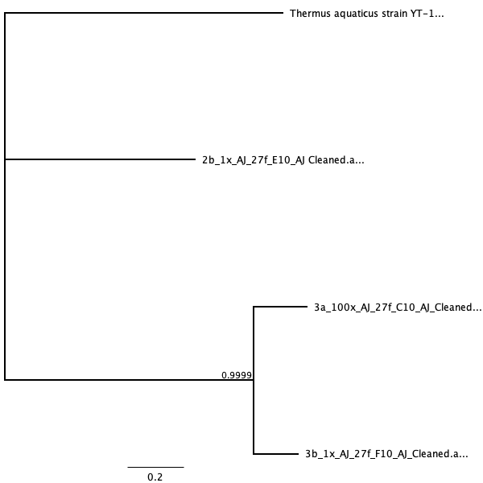

```{r setup, include = FALSE}
knitr::opts_chunk$set(echo = FALSE, message = FALSE, warning = FALSE)
``` 

# Introduction

Cell phones have become an essential tool for modern-day life; in fact, most people tend to not leave the house unless they have their cell phone present. With cell phones becoming more a necessity rather than an accessory, it is interesting to see how much our cell phones can collect from our daily lives. In fact, in a 2014 study done by Meadow et. al, they found that about 22% of the bacterial taxa on participants’ fingers were also present on their own phones, as compared to 17% they shared on average with other people’s phones [@meadow2014mobile]. Meadow et. al's study implies that not only do cell phones hold potential as carriers to our microbiome bacteria, but also to all types of bacteria that are encountered throughout daily life.

This idea is more worrisome when considering how much bacteria our cell phones can bring in, especially when working in expectedly sterile environments such as hospitals or emergency rooms. Karabay et. al (2007) found that health professionals in a teaching hospital in Turkey carried around cell phones that did get contaminated with bacteria such as E. coli which then can cause hospital infections [@karabay2007role]. In this study, 111 of the 122 samples tested exhibited bacterial growth with ten (9.0%) samples indicating infectious bacteria such as *E. coli*, two *Enterococcus feacalis*, two *Pseudomonas aeruginosa*, one *Pseudomonas fluorescensis*, and one *Klebsiella pneumoniae* [-@karabay2007role]. 

In 2009, Ulger et. al, found that from the cell phone screens of 200 health care workers tested at Turkey's Ondokuz Mayis University Faculty of Medicine, 94.5% showed evidence of bacterial contamination [@ulger2009we]. These results indicated that both the workers' hands and phones were similarily contaminated with various types of microorganisms  [-@ulger2009we]. This further justifies that cell phones used in daily practice for health care works may be a source of nosocomial infections in hospitals. However, the risk of unsafe hospital practices are not isolated in only hospitals in Turkey but are seen across the globe. Similarly, in a 2014 article done for Healthcare workers in Nigeria showed the same high percentage of bacterial contamination (94.6%) [@nwankwo2014nosocomial]. Interestingly, they also found that the bacteria isolated from mobile phones of health care workers were more resistant to antibiotics than non-health care worker phones [-@nwankwo2014nosocomial].

To confirm Nwanko et. al's 2014 study, Taher et. al (2019) found that of their isolated bacteria species from the 93 of the studied cell phones, 80% of the bacteria were resistant to antibiotics taken from Nurse and Doctor phones [@taher2019pathogenic]. Thus, this study further emphasizes the dangerous potential for cell phones to be pathogenic bacteria carriers.

To get a better idea as to the real danger of infections caused by bacteria in phones, a study by Tajeddin et. al determined the rate of contamination of health-care workers’ hands and environmental surfaces in intensive care unit by the main bacteria associated with hospital-acquired infections in Tehran, Iran [@tajeddin2016role]. They found that of everything tested, nurses' aides and housekeepers were the most contaminated staff [-@tajeddin2016role]. These results showed how easily contaminated trusted-sterile environments such as the ICU due to the role and neglect of health care workers when dealing with important bacterial pathogens [-@tajeddin2016role].

My project attempts to look more into whether there is a need for more regulation on the hygiene of our cell phones (especially if we work in a hospital setting) [@sepehri2009bacterial]. My main question is to see whether students working in hospitals have fewer bacterial species growing on their phones than students who work outside of the medical field and do not have to follow hospital protocols for sterility. Therefore, my hypothesis is that students who do work at hospitals with their phones on hand tend to sanitize/ sterilize their phones more, thus having significantly fewer bacteria than regular college kids who have no necessary cleaning routine for their cell phones.

In this project, I wanted to test different cell phone screens of regular college students who do not work in the health professions versus college students who are cleared to work in a hospital setting. I was particularly interested in college students due to their high-use of phones and from a study finding that there is a higher level of bacterial contamination found in secondary students' mobile [@koljalg2017high]. Furthermore, I chose to test on a University campus, for similar reasons to Ross et. al in 2015, due to the high human population density and variable building usage including lecture halls, gyms, restaurants, residences, and a daycare [@ross2015microbial]. Thus, I sampled random students at the University of San Francisco but limited my study to focus on students who carry their phones everywhere (even when working in clinical sites such as Saint Mary's Hospital. After collecting my samples, I prepared my collected swabs to be either cultured or un-cultured and analyzed them for bacterial growth based on number of colonies and different morphotypes. Further analysis involved PCR protocol, DNA sequencing and editing into phylogenetic trees, and BLASTing to identify the bacteria found in these cell phones.

My results confirmed that bacterial growth is evident in all cell phones, however, the amount of bacteria morphotypes found in the cell phones of regular students was statistically more than the amount found in the cell phones of nursing students. This result can be attributed to the phone-sanitizing protocols within hospitals which had been notably implemented at Saint Mary's Hospital where the sampled nursing students have their clinicals. However, I also identified the bacteria found in the phones of the regular students (2B and 3B) as *Staphylococcus warneri* strain and *Acinetobacter sp. strain* respectively and one nursing student's phone had matched as the *Moraxella osloensis* strain. Interestingly, all three of the sequenced bacteria were as equally harmful as the other, regardless of whether the student was in nursing or not. The difference in my two results indicates that while cell phones of nursing students are more sanitary in number of bacterial growth, their cell phones still had the potential to carry dangerous and infectious diseases. This emphasizes the need for even more phone regulation when entering a hospital site to avoid any possible contamination when in the presence of sick patients.  

### Study Question
Do students who work in hospitals/ health professions have fewer bacterial species growing on their cell phones than students who work outside of the medical field? 

### Hypothesis
Students who enter hospitals with their phones tend to sanitize before and after entering hosptal rooms, thus having less bacteria than those who can use their phones freely.

### Study Design
I sampled 6 total students at the University of San Francisco, 3 Nursing students who work at the clinical site of St. Mary's hospital (where they are supposed to clean off their phones) versus 3 students who carry their phones regularly on a daily basis. This left me with 12 samples (n = 2 swabs for each student, 12 total) to extract and sequence for bacterial DNA. 

# Methods

## Sampling Plan 
In order to confirm the necessary cell phone sanitizing routine when working in hospitals/ medical professional settings, I sampled this group of Nursing students directly after they come back from working at their clinical site at Saint Mary's Hospital at 1:30 pm, Tuesday, September 3. I tried to avoid students cleaning their phones solely because of their knowledge of being tested and gained each student's consent to swab their phones during the time and site of collection. After swabbing the health professionals, I planned on swabbing the phones of regular students who use their phones freely around the same time (2:10 pm) to avoid bacterial differences due to different samples using their phones for longer further in the day. Thus, I sampled the second group of students on Tuesday, September 3 as well on the University of San Francisco Campus. 

## Sample Collection 

For the collection of my samples, I had previously prepared a kit to meet the students at their easiest convenience. This kit contained 2 pairs of gloves (one for each sample group/ collection time), 6 sterile swabbing kit consisting of two swabs per pack, 6 sterile tubes with Phosphate buffer saline (pH 7.4) to preserve the swabs. 

Each phone from every student (6 total) required two swabs (n = 2, 12 samples total) which were broken off and placed into the labeled test tube. 

The collection sample groups were separated and assigned into two groups: group A and group B. Group A referred to the group that was current USF nursing students working at St. Mary's Hospital and Group B were non-health related students who did not have a hospital background. Each student was given an ID label for either group A and B and a sample number was given randomly passed on collection order (1A, 2A, 3A, 1B, 2B, 3B). 

After two swab samples had been taken from each student, one sample went to freeze for later DNA extraction while the other sample was set up for dilution and culture plating. 

### Sample Preparation for Culturing 

Once one sample had been sent away to freeze for DNA extraction, the other sample was mixed with 200 ul of PBS (7.4 pH) and vortexed for 15 seconds. 

From this sample, two more tubes were prepped and labeled for a 10x dilution and 100x dilution (n = 3 per student, 18 total). For the 10x dilution, the test tube was given 180 ul of PBS plus 20 ul of the original sample and vortexed for 5 seconds. The 100x dilution was given 180 ul of PBS and 20 ul from the 10x dilution and also vortexed for 5 seconds. 

I labeled and used 18 100mm Petri dish culture plates (with TSA, tryptic soy agar, as growth media) to set up bacterial culturing (n = 3 per group, 6 total). 100 ul was then taken from each sample, vortexed, and spread evenly with 8-10 Rattler beads (Spreader beads) around the bottom of the plate for about 10-20 seconds. 

These culture plates were then left to incubate for 37 degrees Celcius overnight with an expected 1 culture growth per plate. 

#### Culture Measurement

The following day (September 4, 2019) I measured each culture plate [for growth of colonies and monophytes.](http://https://docs.google.com/spreadsheets/d/1GTZFUkE8nhY6hZebgxoPr_dam9kGWzlqFg1O4--MyUE/edit#gid=0). 

Each sample was incubated at 37 degrees Celsius and recounted 5 days after on September 9, 2019. For group A: 1A (1 colony, 1 morphotype), 2A (5 colonies, 4 morphotypes), and 3A (2 colonies, 2 morphotypes) all had the highest growth in their 100x dilution while group B: 1B (1 colony, 1 morphotype), 2B (21 colonies, 9 morphotypes), 3B all exhibited most growth at their 1x dilution (70 colonies, 4 morphotypes). 

## DNA Extraction Protocol 

### Culture DNA Extraction
The selected culture plates with the most colonies were given for extraction (September 10, 2019). With a 1.5 ml tube and a sterile pipette tip, cells from one colony from each plate were collected (6 total). 

For DNA Extraction, I followed the Sigma Plant RED Extract-N-AMP PCR Kit [@amplicon201316s]. 

In each 1.5 ml tube, 100 ul of Extraction Solution was added and vortexed for 60 seconds. Afterward, each tube was then incubated for 10 minutes at 95 degrees Celsius and then vortexed for another 60 seconds. 100 ul of Dilution Solution was added to each tube, vortexed for 5 seconds, and centrifuged for 5 minutes at full speed.

Once each sample was done (6 total), they were then set up for Quibit protocol. I used a Qubit Fluorometric Quantification to quantitate the amount of DNA was present in each prepped tube (ng/ul). Each cultured sample was recorded for their amount of Quibit data (1A: 5.13 ng/ul, 2A: 8.09 ng/ ul, 3A: 9.75 ng/ul, 1B: 7.08 ng/ul, 2B: 7.4 ng/ul, 3B: 10.8 ng/ul).

### Culture free DNA Extraction
The original frozen sample that was set aside during sample collection (September 3, 2019) was redistributed and prepped for DNA Extraction (September 11, 2019, 6 samples total)

This protocol also used the Sigma Plant RED Extract-N-AMP PCR Kit [@amplicon201316s]. 

Each sample was thawed and 100 ul of Extraction was added and vortexed for 60 seconds. The samples were then incubated for 10 minutes at 95 degrees Celsius and then vortexed for another 60 seconds. After, 100 ul of Dilution Solution was added and vortex for 5 seconds and centrifuged for 5 minutes. 

Once finished, these samples followed the Qubit extraction (6 total). I used a Qubit Fluorometric Quantification and each cultured sample was recorded for their amount of Qubit data (1A: 6.05 ng/ul, 2A: 5.52 ng/ ul, 3A: 4.83 ng/ul, 1B: 5.91 ng/ul, 2B: 5.23 ng/ul, 3B: 4.34 ng/ul).

I recorded all data [with dilution id, concentration, and whether it was the culture or culture-free extraction.](https://docs.google.com/spreadsheets/d/19dQy8kxYwU4dCJ-AuaFwOA8AL4E97rX6VH8wT3gvDuc/edit#gid=0).

## PCR Protocol
### PCR for Culture

On September 17, 2019, I set up a PCR protocol for the cultured samples (6 total).

For my master mix, each reagent followed the equation: (n+1) + 10% (+ 1 accounting for control, and 10% accounting for any mess-ups). Including my control, I had a total of 7 samples for PCR. This resulted in calculated volumes (for n = 7 samples) of 77 ul of AMP, 6.2 ul of 27 F primer, 6.2 of 1492 R primer, 7.7 ul of BSA, 49.5 ul of H2O and 1 ul of Template DNA or 1 ul of water for the control. 

17 ul of my master mix was added to each PCR tube (7 total) (although the original protocol called for 19 ul, I ended up not having enough mix.

The PCR Cycle started with the denaturing at a high temperature with PCR Conditioning starting from step one of 95 degrees C for 5 minutes, then 94 degrees C for 30 seconds, 65 degrees C for 30 seconds, and finally 72 degrees C for 1 minute. This went on for 10 cycles and each step going down 1 degree per cycle to ensure copies. 

PCR followed 25 more cycles of 94 degrees C for 30 seconds, 55 degrees C for 30 seconds, 72 degrees C for 1 minute. Finally, 72 degrees C for 10 minutes, and 4 degrees C of holding. 

This resulted in a total number of 35 cycles. 

#### Gel Electrophoresis 

Following PCR, gel electrophoresis was used running on 2 percent Agarose gel with SYBR Safe Dye added to it. 4 ul of each sample was pipetted onto the gel and ran under 140V for 30 minutes. 

I photographed the final product of gel electrophoresis and noted band intensity and successful amplification.  

#### Exo-SAP
On September 23, 19, after successful amplification for gel electrophoresis, PCR products were cleaned with ExoSAP (Invitrogen) and sent for unidirectional Sanger sequencing at MCLAB (South San Francisco, CA). This was meant to digest the samples for a better Sanger Sequencing template. 

### PCR of Uncultured Data (+ Illumina)

Following gel electrophoresis, PCR products were purified using AmpureXP magnetic beads (Beckman-Coulter) and quantitated using a PicoGreen fluorescent assay (Invitrogen) on a Tecan Infinite M Plex plate reader (September 23, 2019). 

My master mix followed the equation (n+1) + 10% (+ 1 accounting for control, and 10% accounting for any mess-ups). In total, I had 77 ul of AMP,6.2 ul of 10 uM Iseq 165 F, 6.2 ul of 10 uM Iseq 165 R, 7.7 ul of BSA, 1 ul of the template of water for the control, and 49.5 ul of H2O (for 7 samples total, including control).

Purified PCR products were used as the template for a second round of PCR, which served to attach unique pairs of forward and reverse Illumina barcodes (Nextera XT Index 2 kit). All other components of the PCR mixtures were as for the first-round PCR. These reactions were cycled at 95 degrees C for 3 minutes, then 8 cycles of: 95 degrees C for 30 s, 55 degrees C for 30s, and 72 degrees C for 30s, followed by a 5 minute elongation cycle at 72 degrees C. 

The PCR Cycle started with the PCR Conditioning starting from step one of 95 degrees Celsius for 3 minutes, then 95 degrees Celsius for 30 seconds, 55 degrees Celsius for 30 seconds, 72 degrees Celsius for 30 seconds, 72 degrees for 5 minutes, and finally a 4 degrees Celsius hold. This went on for 25 cycles, resulting in PCR products 1,024 times smaller than the previous PCR.  

The following day, the Culture Free Samples underwent another round of PCR (with 8 more cycles) for a total of 32 rounds of PCR (September 25, 2019). 

#### Qubit 
PCR products were then purified and normalized with a SequelPrep normalization plate (Invitrogen), pooled, and then quantified once again with a Qubit 4 fluorometer (Invitrogen) and a TapeStation 4200 (Agilent) to verify library size and concentration. 

#### Illumina Library 
This library was then diluted to the loading concentration (50 pM) and combined with an Illumina PhiX spike-in library (5% spike in) and sequenced on an Illumina iSeq using a 2 x 150 bp consumable cartridge.

## Sequencing and Editing

After being sent out from the lab, my sequences were uploaded onto Geneious Prime for editing and IUPAC Coding (7 total, including water). 

First, I made sure to check that my sequences had fully run. Here, only my samples 3a, 2b, and 3b ran all the way three and were ready to be edited. Editing involved trimming both the beginning and end of each sequence to make sure there was not too much noise. This also involved looking at any areas where the DNA seemed ambiguous and using my best judgment to fill in the data using IUPAC Ambiguity codes. 

Once I reached a high enough HQ% we used alignment to realign the working sequences with a sequence of DNA from my outgroup of Thermus Aquaticus Strain YT-1 16 S (downloaded from the NCBI genebank), this was aligned using MAFFT (Multiple Alignment using Fast Fourier Transform). Again, this realignment was trimmed at the beginning and end for each sequence to align perfectly with the outgroup. Once aligned, I used Geneious to create a PhyML Tree and Mr. Bayes to create phylogenies comparing my DNA sequences to the outgroup. The PhyML Tree followed a substitution model of GTR with a Branch Support of Boostrap (100 Bootstraps). Mr. Bayes ran also under GTR, a rate variation of invgamma, a chain length of 1,100,000, a subsampling freq of 200, and a burn-in length of 100,000. 

# Results
```{r load-libraries}
library("ggplot2")
library("dplyr")
library("tidyr")
library("readr")
library("broom")
library("knitr")
library("citr")
library("lintr")
```

Following PCR Protocol, Gel Electrophoresis was done to analyze DNA molecular size and compare it alongside other samples. Each gel ran on 2 percent Agarose gel with SYBR Safe Dye added to it. These samples ran overnight alongside a ladder for comparison. 

## Gel Electrophoresis Image - Culture


**Figure 1:** Image of Gel Electrophoresis for Culture Data. PCR bands corresponding from samples 1A, 2A, 3A, 1B, 2B, 3B, and control (left to right) are shown within the red box highlighted. A ladder is shown (furthest to the left) for comparison.

The final gel electrophoresis showcased strong bands are seen in samples 1A,2B,and 3B. 2A and 3A were described as light bands with no bands for 1B and the control. This shows how molecules are separated based on size and charge and helps indicate whether our PCR protocol would work by showing the products that contained DNA forming bands. 

After ensuring that my samples had run to completion, I also wanted to quantify my culture data for any statistically significant results between my two sample groups by using my previously collected data for counting colony abundances. This data was taken after analyzing my Petria TSA plate samples, using the sample dilutions with the most amount of data.

## Culture Data 
```{r read-in-culture-data}
# read in the culture data from csv
culture_data <- read.csv(
  "data/raw_data/raw_culture_count_data/BIOL422_culturing_data.csv")
```

### Culture Data Colony 100x Box Plot 
```{r filter-and-plot-abundances}
# filter out only my 100x dilutions and make a boxplot
culture_data %>%
  filter(student_name == "Angela_Jocson") %>%
  filter(dilution_1_10_or_100 == "100") %>%
  ggplot(aes(x = sample_group,
             y = as.numeric(number_of_colonies))) +
  geom_boxplot() +
  ggtitle("Comparison of colony abundances
          between Nursing Students and Regular Students", "100x dilution") +
  xlab("Sample Group") +
  ylab("Number of Colonies")
```

**Figure 2:** Boxplot of colony abundances at different sites, 100x dilution. Despite a higher median number of colonies from Nursing Students versus Regular Students, the mean numbers of colonies were not significantly different between the two sites (Wilcox p = 0.1908, fail to reject the null hypothesis) 

From this collected data, I used a box plot to see the average and any outliers within my data. I also used a statistical test in order to determine how statistically significant my results were. This would allow me to make a confident conclusion as to how to interpret my data.

```{r abundances-stats}
# run a statistical test to compare the two groups of abundances
## if p value is greater than 0.05 then fail to
## reject null hypothesis that they are equal

culture_data %>%
  filter(student_name == "Angela_Jocson") %>%
  filter(dilution_1_10_or_100 == "100") %>%
  wilcox.test(data = .,
              as.numeric(number_of_colonies) ~ sample_group) %>%
  broom::glance(x = .) %>%
  knitr::kable()
```

I also wanted to look at the different types of morphotypes that appeared from each sample. Using a different variable other than colony abundances was important as colony morphotypes is a common measurement for diversity and/or isolation of the dominant species within bacterial communities [@10.1111/j.1574-6968.1998.tb12903.x]. Colony morphotypes can also be used to identify different species for physiological and genetic purposes [@10.1111/j.1574-6968.1998.tb12903.x]. 

## Culture Data Morphotype 100x Box Plot 
```{r filter-and-plot-morphotypes}
# filter out only my 100x dilutions and make a boxplot
culture_data %>%
  filter(student_name == "Angela_Jocson") %>%
  filter(dilution_1_10_or_100 == "1") %>%
  ggplot(aes(x = sample_group,
             y = as.numeric(number_of_morphotypes))) +
  geom_boxplot() +
  ggtitle("Comparison of morphotypes between Nursing Students
          and Regular Students",
                "1x dilution") +
  xlab("Sample Group") +
  ylab("Number of Morphotypes")
```

**Figure 3:** Boxplot showing the number of morphotypes from the two different sites. There was a difference in the mean number of morphotypes (Wilcox p = 0.05, reject the null hypothesis)

```{r morphotype-stats}
# run a statistical test to compare the two groups of abundances
culture_data %>%
  filter(student_name == "Angela_Jocson") %>%
  filter(dilution_1_10_or_100 == "1") %>%
  wilcox.test(data = .,
              as.numeric(number_of_morphotypes) ~ sample_group) %>%
  broom::glance(x = .) %>%
  knitr::kable()
```

Boxplots from culture data show that while the number of colonies between the two groups (Group A - Nursing, Group B - Regular) were not significantly (p = 0.1908, Figure 2), the difference of the number of morphotypes suggest evidence of rejecting the null hypothesis due to p = 0.05 (Figure 3). This provides evidence that there the higher number of morphotypes within Group B (regular college students) in comparison to Group A (nursing students) is statistically significant.     

## Sequencing 

As my samples werent sent to a lab and returned as sequenced DNA files, each DNA file was analyzed as whether they had failed or ran completely. Files that ran completely were cleaned and trimmed to be adjusted. I organized my data into a table in order to properly categorize and document the edits that were made to each successful sequence. 

## Table for each of my sequences 
| Sample ID | Original File Name     | Corrected File name                    | Usability | Length after Trimming | Manually Adjusted Bases |
|-----------|------------------------|----------------------------------------|-----------|-----------------------|-------------------------|
| 1A        | 1a_100x_AJ_27f_A10.ab1 | 1a_100x_AJ_27f_A10_AJ_Failed.ab1       | No        | N/A                   | N/A                     |
| 2A        | 2a_100x_AJ_27f_B10.ab1 | 2a_100x_AJ_27f_B10_AJ_Failed_Blast.ab1 | No        | N/A                   | N/A                     |
| 3A        | 3a_100x_AJ_27f_C10.ab1 | 2b_1x_AJ_27f_E10_AJ Cleaned.ab1        | Yes       | 520                   | 2                       |
| 1B        | 1b_1x_AJ_27f_D10.ab1   | 1b_1x_AJ_27f_D10_AJ_Failed.ab1         | No        | N/A                   | N/A                     |
| 2B        | 2b_1x_AJ_27f_E10.ab1   | 2b_1x_AJ_27f_E10_AJ Cleaned.ab1        | Yes       | 518                   | 8                       |
| 3B        | 3b_1x_AJ_27f_F10.ab1   | 3b_1x_AJ_27f_F10_AJ_Cleaned.ab1        | Yes       | 496                   | 2                       |

**Table 1:** Table showing the locus of each sequence (16S), original filename of each sequence, the filename after correcting or marking as failed, its usability (useable vs unusable), length after trimming, and number of manually corrected in the remaining sequence after trimming.

Successful sequences were 3A, 2B, and 3B. The other sequences had failed to run code (showing 'NNNN only) or had too much noise (2A). The data was then trimmed and sequenced to be ready for alignment with the outgroup *Thermus aquaticus* strain YT-1 16 S. Any ambiguity was manually corrected following [the IUPAC ambiguity code](https://droog.gs.washington.edu/parc/images/iupac.html).


## Table for each of my successful Sanger Sequences after BLAST 
| Sample | Description                           | Percent Identity | Query Cover | Ascension  | E Value |
|--------|---------------------------------------|------------------|-------------|------------|---------|
| 1A     | Sequence Failed                       |                  |             |            |         |
| 2A     | Sequence Failed                       |                  |             |            |         |
| 3A     | Moraxella Osloensis Strain PK2-16.2   | 98.65%           | 99%         | MN428170.1 | 0.0     |
| 1B     | Sequence Failed                       |                  |             |            |         |
| 2B     | Straphylococcus warneri strain SR5-28 | 99.61%           | 100%        | MN421516.1 | 0.0     |
| 3B     | Acinetobacter sp. strain GR14 16S     | 100%             | 100%        | MH883927.1 | 1e-139  |

**Table 2:** Table of successful Sanger Sequences after NCBI BLAST Results. This table indiccates the BLAST result metricts which include description, percent identiy, query cover, ascension and E value. 

All results from the Table were taken from NCBI Gene Bank. Each successful sequence had a high percent identity with its match found. 3A was matched with the Moraxella osloensis Strain, 2B with the *Straphylococcus warneri* strain, and finally 3B had the *Acinetobacter* strain. Other strains had failed to sequence therefore not coming with any matches. 

## Phylogenies 

Following successful sequencing, my sequences were then aligned for proper phylogenetic analysis using Geneious Prime. My phylogenetic trees represent the relatedness between my sequences and the outgroup, *Thermus aquaticus*. Phylogenies allow for easier identification of the bacteria found on my samples. Two phylogenetic trees were created using different methods of construction, PhyML and Mr. Bayes. 

### PhyML Phylogenetic Tree

**Figure 4:** PhyML Phylogenetic tree run on Geneious Prime from Sanger Sequencing Data. Sequences that ran are 3A, 2B, and 3B with an outgroup of *Thermus aquaticus* Strain YT-1 16 S.

### Mr. Bayes Phylogenetic tree

**Figure 5:** Mr. Bayes Phylogenetic tree run on Geneious Primer from Sanger Sequencing Data. Sequences that ran are 3A, 2B, and 3B with an outgroup of *Thermus aquaticus* Strain YT-1 16 S.

The PhyML Tree used the parammeters of substitution model of GTR with a value of 100 Bootstraps. Mr. Bayes ran also under GTR, a rate variation of invgamma, a chain length of 1,100,000, a subsampling freq of 200, and a burn-in length of 100,000. Phylogenetic differences between the two trees are based on the placement of 2b in relation to the related 3A and 3B and the outgroup. I found that both trees strongly associate 3A and 3B together with PhyML tree's bootstrap value of 100 and Mr. Bayes is about 0.999 (Figure 4, 5, ML bootstrap 100 ~= Bayes 0.999). While PhyML associates 2B more closely related to 3A and 3B, Mr. Bayes places 2B alongside the outgroup.  

## Trimmmomatic

## BLAST analysis 

# Discussion 
## Summary

Mobile phones have become one of the indispensable accessories in everyday modern life [@karabay2007role]. Cell phones are taken with us everywhere even in hospital halls, laboratories, and/or intensive care units when dealing with severe illnesses [@karabay2007role]. Moreover, college students were also noted to not only take their phones everywhere, but also are exposed to the most among germs do the density of college campuses and students [@ross2015microbial]. Thus, my study attempted to analyze whether college students who do enter hospitals (such as Nursing students) have the potential at being bacterial carriers for infections due to their cell phone use. Specifically, I had sampled the phones of 6 total college students at the University of San Francisco, 3 of which were Nursing students working at the clinical site at St. Mary's Hospital while the other 3 were just regular non-health related students. I had wanted to see whether Nursing students did sanitize their phones and take extra precautions in limiting their bacterial contact in comparison to regular college students. I hypothesized that Nursing students were required to clean their phones, thus showing less bacterial growth. However, my data suggested that there was no difference in the number of colonies found between the two groups (Figure 2), but there was statistical evidence indicating that there was a difference in the number of morphotypes with the colonies (Figure 3). Interestingly, I also found that the bacteria found in the phones of the regular students (2B and 3B) indicated bacteria that were just as likely to be infectious than the bacteria found from the nursing student (3A). 2B showed up as the *Staphylococcus warneri* strain and 3B was the *Acinetobacter sp. strain*, while 3A had matched as the *Moraxella osloensis* strain. This contracted previous studies which indicated that those who worked in the medical/ healthcare setting had much more resistant and dangerous bacteria found within their phones [@taher2019pathogenic]. While there was no complete indication that Nursing students had fewer bacteria than regular students, it was evident that Nursing students (Group A) had much fewer morphotypes in the colonies found in Group B. This provides some closure that Nursing students, at least the University of San Francisco, have much better safety precaution in comparison to regular college students.  

## Interpretation and Taxa

From my evidence found in Figure 3, it can be interpreted that there are many more types of bacteria growing on regular students’ cell phones in comparison to the Nursing students. This could be due to the fact that Nursing students are found in the sterile environment, and as pointed from the data that they do clean their phones, they are more likely to come across the same type of bacteria rather than regular college students who can go around anywhere without worrying about sanitizing. There is also the interpretation that the number of colonies may not be as indicative when comparing the "cleaner" phone (fewer bacteria), as colony growth can vary between types of bacteria whether it be based on environment, growth rate, conditions, temperature. Thus, I found the number of morphotypes to be more indicative of the difference between nursing students and regular students.

However, the difference between the two groups could easily be manipulated based on uncontrollable variances in each student’s life. For example, one student could use their phones much more carelessly by placing it on dirty surfaces, letting it stay on the floor, while another student could keep their phones in their backpacks for the day. There could also be differences in lifestyles as nursing students, like someone being on their phone during clinical site, while the other keeps it in their pocket most of the time. There was also a difference in livelihood like someone living in the dorms or a crowded house, visiting the gym more often, or even general body hygiene (such as washing hands). While I do think my data is statistically significant, it is also important to consider all possibilities when considering the two groups. 

It was also interesting to see the data from Table 2 that indicates the BLAST matches of each successfully ran sequence (3A, 2B, 3B). From these sequences and the bacteria associated, it is also easier to interpret the phylogenetic trees (Figures 4, 5). I agreed that both trees had correctly placed 3A and 3B together due to the high bootstrap values of PhyML tree's being 100 and Mr. Bayes is about 0.999 (Figure 4, 5, ML bootstrap 100 ~= Bayes 0.999). While PhyML associates 2B more closely related to 3A and 3B, Mr. Bayes places 2B alongside the outgroup. This can be better interpreted through understanding the epidemiology of exactly the bacteria that most matched my data from the NCBI genebank BLAST tool was. I found that the *Staphylococcus warneri* strain most matched my sample 2B, 3B as the  Acinetobacter sp. strain, and 3A was most matched to the *Moraxella osloensis* Strain. As previously mentioned, each bacteria was found to be just as probable for infection if spread and contaminated.

While I agree with the bootstrap values of my phylogenetic tree, it was hard to actually pinpoint what made 3A and 3B much more closely related in comparison to 2B. I did mention that each of the bacteria strands was just as probable for infection, there were differences in the severity of each infection. For sample 2B, *Staphylococcus warneri*, it is a member of the bacterial genus *Staphylococcus* which can cause infection in patients whose immune system is compromised [@campoccia2010characterization]. *S. warneri* causes infectious usually in association due to implant materials, orthopedic infections, or the absence of a foreign body [-@campoccia2010characterization] orthopedic infections. Also dealing with skin and epithelium, the *Moraxella osloensis*, found as 3A, is also a gram-negative bacterium that is saprophytic on skin and mucosa [@lim2018complete]. This strain, like the *Staphylococcus*, is frequently involved in human infectious diseases [-@lim2018complete]. Found in 3B, **Acinetobacter* is also the genus of Gram-negative bacteria belonging to the wider class of *Gammaproteobacteria* which are known to cause high mortality infections like its strand *A. baumannii* with high virulence and antimicrobial resistance [@kuo]. *Acinetobacter spp.* first began to be recognized as significant healthcare-associated pathogens during the 1970s and many of these infections involve multidrug-resistant strains and occur in intensive care or high-dependency units in which severely-ill or debilitated patients are treated extensively with broad-spectrum antibiotics [-@kuo]. Thus, based on where the bacteria attacks, it would be more considerable that 2B and 3A were more closely related than 3A and 3B based on the level of virulence. However, after more research, *Staphylococcus* was less likely to be as deadly as 3A and 3B when it comes to being infectious. Thus, from my data, it can be interpreted that 3A and 3B are more closely related as seen in Figures 4 and 5, while 2B is more closely related to the outgroup the *Thermus aquaticus.* To determine how much closer related 2B was to the outgroup, a study done by Delarue et. al stuck out in which they looked at the polymerase sequence from bacteriophage SPO2 and found that to be homologous to the polymerase domain of polymerase I from Escherichia coli, which is also closely related to those from *Staphylococcus pneumoniae*, *Thermus aquaticus*, and bacteriophages T7 and T5 [@delarue1990attempt]. Thus, this shared homology with this bacteriophage that Delarue et. al looked at, also indicated a link between Staphyloccocus and *Thermus aquaticus*. From this study, the correct taxa from my data are seen within my Mr. Bayes phylogenetic tree (Figure 5). 

## Error Analysis 

Due to the low number of actual sequencing DNA, it can be interpreted that there may have been something wrong during collection, extraction, PCR protocol, or even sequencing and everything in between (Table 1). 

Key data points that may have resulted in a lack of successful sequencing could be due to experimental error. During PCR Protocol, my master mix had actually run out before the 19 ul could be delivered to each sample. Instead, I had decided to modify the procedure and use 17 ul. Thus, there could be an indication that there was not enough template for the sequence to amplify. My data also showed a lot of compression among sequences indicating DNA fragments of different sizes with the same electrophoretic mobility, ie fragments that migrate on top of each other during electrophoresis (@dillon). This phenomenon is thought to be caused by regions of secondary structure within the template DNA which could be due to PCR not having high enough temperature for denaturing. Also notable, my gel electrophoresis already indicated a failure in 1B (Figure 1), which coincides with the idea that my sequences failed to run. There were also issues with editing my sequences as a lot of them were judgment calls. This could have caused change base pairs that were manipulated to better fit one bacteria more as opposed to another. This could also have skewed the placement of my phylogenetic tree. 

Other evidence of experimental failure could be due to cross-contamination, whether it be from extracting too much TSA when scraping the culture from the culture plates or by not being extra cautious when using pipette tips and handling other tools. As my Qubit data showed high numbers in the correct range, there is also the possibility that the bacteria that are found on the phones are resistant to PCR, air, water-- indicating that there is a lot of versatility in bacteria that my protocol could not account for. If that is the case, PCR could be redone at high temperatures to ensure complete denaturing of the DNA strands and longer cycles for higher amplification.

# Sources Cited

